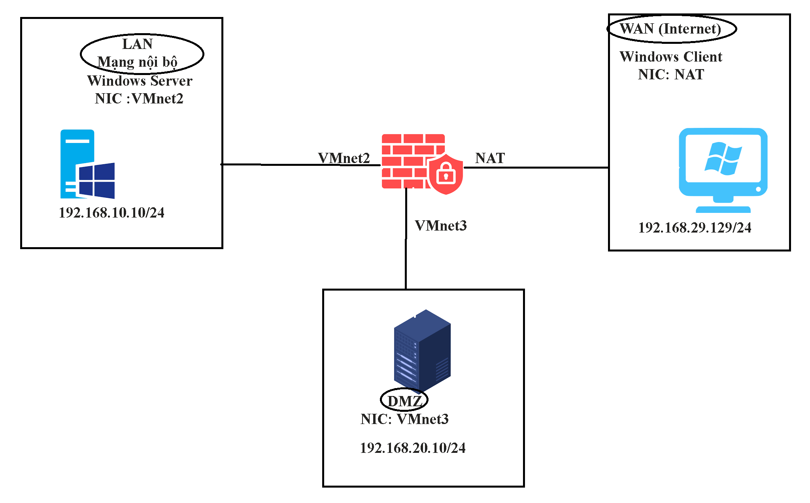

#  I. Tổng quan đề tài
## 1. Giới thiệu mô hình
Đề tài thực hiện việc tìm hiểu cách cài đặt, triển khai Firewall bằng pfSense, cách đặt luật, cài đặt DMZ cũng như kết hợp hệ thống cảnh báo phát hiện xâm nhập IDS/IPS trên nền tảng ảo hóa VMWare. Đề tài được xây dựng theo mô hình bao gồm:
* Firewall pfSense dùng 3 card mạng (NAT, VMnet2, VMnet3).
* DMZ dùng dùng hệ điều hành Windows 10 với 1 card mạng (VMnet3).
* Web Server dùng Windows Server 2012 với một card mạng (VMnet2).
* Máy Client dùng hệ điều hành Windows 10 với card mạng (NAT).
Mô hình như hình:
 
## 2. Công việc sẽ thực hiện
Công việc sẽ thực hiện bao gồm:
* Triển khai một Website cơ bản để demo cho chức năng của Web Server.
* Triển khai DMZ.
* Tiến hành Port Forward để NAT lớp mạng NAT vào lớp mạng LAN.
* Tiến hành tìm hiểu các rule cơ bản trên firewall.
* Cài đặt hệ thống IDS/IPS.
# II. Tiến hành
## 1. Triển khai Web Server
Sử dụng một WebSite có được thiết kế sẵn để cài đặt Web Server