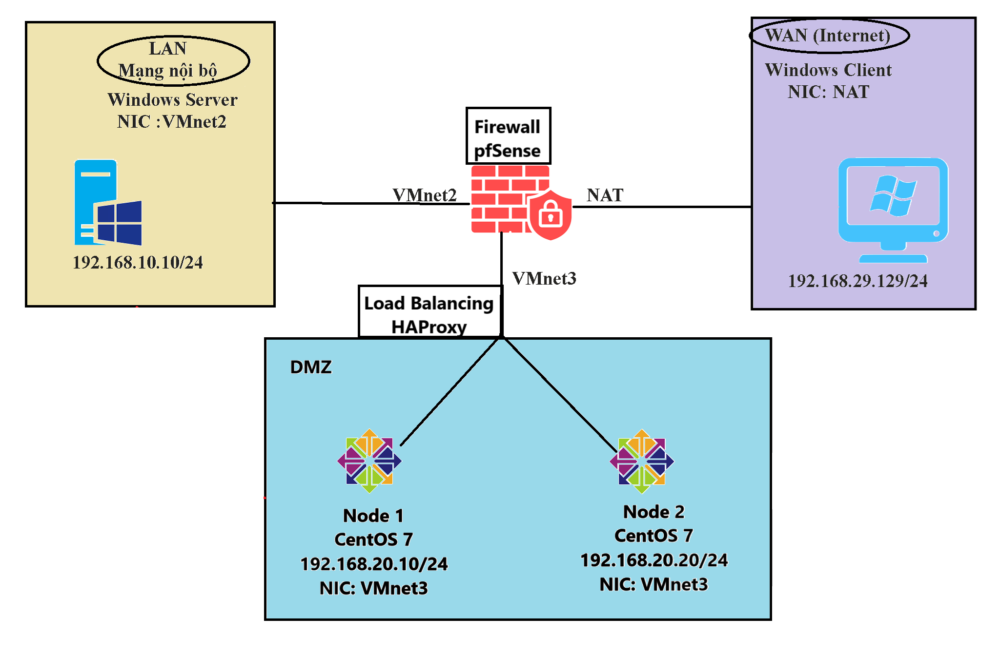
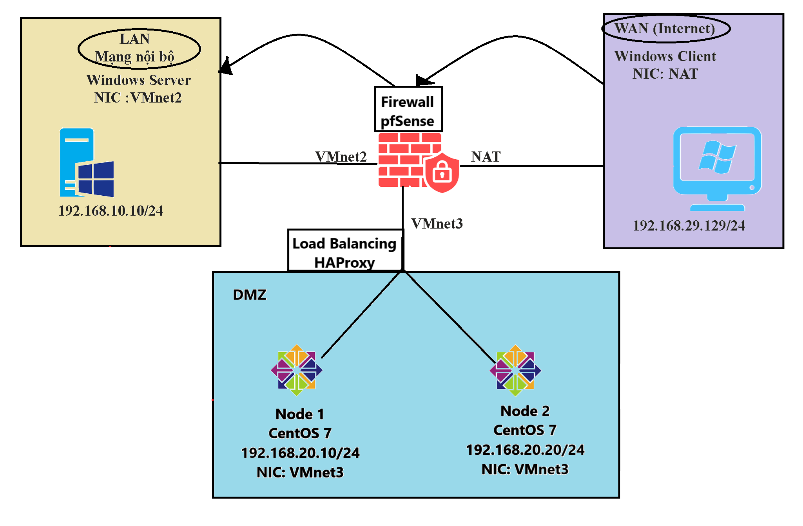
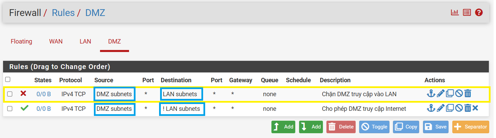

# Tìm hiểu Firewall, IDS/IPS trên VMWare
#  I. Tổng quan đề tài
## 1. Giới thiệu mô hình
Đề tài thực hiện việc tìm hiểu cách cài đặt, triển khai Firewall bằng pfSense, cách đặt luật, cài đặt DMZ sử dụng Load Balancing HAProxy cũng như kết hợp hệ thống cảnh báo phát hiện xâm nhập IDS/IPS trên nền tảng ảo hóa VMWare. Đề tài được xây dựng theo mô hình bao gồm:
* Firewall pfSense dùng 3 card mạng (NAT, VMnet2, VMnet3).
* DMZ dùng 2 máy ảo hệ điều hành CentOS 7 với 1 card mạng mỗi máy (VMnet3).
* Web Server dùng Windows Server 2012 với một card mạng (VMnet2).
* Máy Client dùng hệ điều hành Windows 10 với card mạng (NAT) có thể dùng máy vật lý để tối ưu không gian lưu trữ.



Tải và cài đặt file img pfSense tại `https://atxfiles.netgate.com/mirror/downloads/`

## 2. Công việc sẽ thực hiện
Công việc sẽ thực hiện bao gồm:
* Triển khai một Website cơ bản để demo cho chức năng của Web Server để chứng tỏ rằng mô hình này Web Server có thể được dùng để triển khai làm server nội bộ hoặc để quản lý DMZ.
* Tiến hành thử nghiệm chức năng Port Forward để NAT lớp mạng NAT vào lớp mạng LAN.
* Tắt tính năng Port Forward, dựng 2 WebServer trên 2 máy ảo CentOS7.
* Triển khai DMZ kết hợp Load Balancing bằng HAProxy với 2 node chạy CentOS 7 với chức năng chịu tải cho Website.
* Cài đặt hệ thống IDS/IPS.

# II. Tiến hành thực hiện
## 1. Port Forwarding
### a) Triển khai Web Server Local trên Windows Server
* Trên Windows Server 2012 truy cập vào Server Manager, chọn **Manage** -> **Add roles and featuers**
* Tiếp tục thực hiện các bước đến khi chọn gói cài đặt, ta chọn gói Web Server (ISS) để cài.


* Khi đã cài hoàn tất, ta vào Tool và vào ISS vừa mới cài xong. Bên cột bên trái ta tiến hành tạo một web site mới với tên, đường dẫn đến file index.html, địa chỉ IP và port được điền đầy đủ, có thể tham khảo hình dưới.   


* Ở đề tài này, website được thiết kế sẵn, bạn có thể tham khảo các website mẫu khác để thực hiện demo.


* Sau khi xong các bước cài đặt website ta tiến hành chạy thử bằng cách chọn Browse Website bên cột phải.


 * Hoặc đơn giản hơn là dùng trình duyệt và truy cập `https://IP_SERVER:PORT` như ở lab đã cấu hình thì truy cập `https://192.168.10.10:8081` ta được kết quả tương tự như hình.
 

### b) Tiến hành Port Forward để NAT lớp mạng NAT vào lớp mạng LAN.
#### b.1 Cấu hình
 Truy cập vào **Firewall** -> **NAT** và tiến hành Add theo các cấu hình dưới:
```
    interface WAN
    Address Family IPv4
    Protocol TCP/UDP
    Source Any
    Source port range Any
    Destination port range HTTP to HTTP
    Redirect target IP 
        Type Address or Alias 192.168.10.10
    Redirect target port
        Other 8080
```
 Ta sẽ được kết quả là một Rule mới trong NAT như hình:
 

 Tiếp theo truy cập vào **Interfaces** -> **WAN** và bỏ chọn mục `Block private networks and loopback address` như hình:
 
* `Block private networks and loopback address` : 
IP Private là những IP được cấp trong mạng LAN ví dụ 192.168.x.x/24, 10.x.x.x/8, 172.16.x.x/16. Nhưng việc những IP xuất hiện trên mạng internet dưới dạng IP Public là một điều bất thường nên Rule này sẽ chặn nhưng traffic đến card mạng WAN với source address là những IP private kể trên. 
* Việc **bỏ chọn** `Block private networks and loopback address` là để thuận tiện cho việc demo bởi lớp mạng WAN là 192.168.29.0/24 được cấp bằng DHCP của card mạng NAT trên VMWare. Tuy nhiên trong thực tế nên áp dụng Rule này.
* `Block bogon networks` : IP bogon là những địa chỉ IP không hợp lệ, có thể là những dãy IP không được IANA (Internet Assigned Numbers Authority) cấp phát hoặc những dãy được dùng với mục đích cụ thể không phải để định danh như Multicast,TEST-NET-1, TEST-NET-2, TEST-NET-3,...
* Việc **chọn** `Block bogon networks` hoàn toàn không ảnh hưởng đến kết quả demo và hoàn toàn phù hợp với thực tế.


Bước tiếp theo ta truy cập vào **Firewall** -> **RULES** chọn card **WAN** và tiến hành add rule theo các cấu hình dưới:
```
    Rule 1: Allow inbound Web Traffic to Server

    Action Pass
    Interface WAN
    Address Family IPv4
    Protocol TCP/UDP
    Source Any
    Source Port Range any
    Destination WAN address
    Destination Port Range
        other 8080 to 8080
```
```
    Rule 2: Bất kỳ traffic nào (TCP/UDP) đến cổng WAN 
    ở port 80, hãy chuyển nó vào 192.168.10.10 ở port 
    8080.

    Action Pass
    Interface WAN
    Address Family IPv4
    Protocol TCP/UDP
    Source Any
    Source Port Range any
    Destination 
        Address or Alias 192.168.10.10
    Destination Port Range
        other 8080 to 8080
```
Sau khi cấu hình xong ở Rule sẽ như hình:

#### b.2 Kiểm tra cấu hình
Sau khi cấu hình NAT port Forward rồi thì Client từ ngoài Internet dùng card mạng NAT có thể truy cập đến Website đặt trong mạng LAN như hình dưới IP `192.168.29.131` là IP card mạng NAT trên Firewall.

Vì chưa cấu hình DMZ nên Firewall sẽ redirect sang trực tiếp WebServer nội bộ.


✍️ Như vậy mục này ta đã kiểm thử được cách truy cập từ mạng Internet (WAN) vào trong Web Server (LAN) bằng Port Forwading.

## 3. Triển khai DMZ kết hợp Load Balancing
### a. Cấu hình Web Server trên CentOS bằng Apache
Vì CentOS 7 đã ngừng hỗ trợ nên việc update các package cũng như cài các dịch vụ mới sẽ gặp rắc rối. Bạn đọc có thể tham khảo cách dưới được tổng hợp theo nguồn Internet, phục vụ cho việc demo.

[Cách cấu hình CentOS để update và cài đặt gói mới](https://github.com/tanduong9424/trick/blob/main/README.md)

Sau khi update hoàn tất, tiến hành cài đặt apache theo câu lệnh ``yum install httpd -y``

Thực hiện cấu hình lại file ``nano /etc/httpd/conf/httpd.conf``, thêm vào cuối file câu:
```
IncludeOptional conf.d/*.conf
NameVirtualHost *:80
```

Tiếp theo ta tạo mới file example.conf để cấu hình ``nano /etc/httpd/conf.d/example.conf`` theo mẫu dưới:
```
<VirtualHost *:80>
	ServerAdmin webmaster@htd.edu.vn
	DocumentRoot /home/htd/Desktop/web/WebBanAoDaBanh/index
	ServerName htd1.vn
	ServerAlias fit.htd1vn
	<Directory /home/htd/Desktop/web/WebBanAoDaBanh/index>
	        Options Indexes FollowSymLinks
	        AllowOverride All
	        Require all granted
	 </Directory>
</VirtualHost>
```
**Chú ý:**
* ServerAdmin là email, thông tin của chủ Website.
* DocumentRoot là đường dẫn tới file **index.html** thường sẽ là ``www/root/html``
* ServerName là tên miền (nếu có).
* ServerAlias là Alias cho tên miền.

Sau khi điều chỉnh hoàn tất ta tiến hành gán quyền cho và restart Apache.
```
sudo chown -R htd:htd /home/htd/Desktop/web/WebBanAoDaBanh
sudo chmod -R 755 /home/htd/Desktop/web/WebBanAoDaBanh
chmod +x /home/htd/Desktop/web/WebBanAoDaBanh/index/index.html

chmod o+x /home
chmod o+x /home/htd
chmod o+x /home/htd/Desktop
chmod o+x /home/htd/Desktop/web
chmod o+x /home/htd/Desktop/web/WebBanAoDaBanh

systemctl enable httpd
systemctl start httpd
systemctl restart httpd
```
### b. Cài đặt, cấu hình Load Balancing
Truy cập vào giao diện quản lý pfSense, truy cập **System**->**Package Manager**->**Available Packages**-> Tìm kiếm gói **HAProxy** và cài đặt.

Khi cài xong truy cập **Services**->**HAProxy** để tiến hành cấu hình.

Ở phần **Settings** ta tích vào để bật HAPRoxy như hình và kéo xuống cuối cùng để **SAVE** :


Bên tab **BackEnd**, ta tạo mới một Pool, đây sẽ là nơi chứ các node cho Load Balancing, như trong mô hình đã đề cập, ta tạo 2 node ``192.168.20.10:80`` và `` 192.168.20.20:80`` như hình dưới:


Đồng thời ta có thể chọn thuật toán Load Balancing ở tab ``Loadbalancing options``, ở đây để đơn giản ta có thể chọn Round Robin.


Bên tab **FrontEnd**, ta tạo mới một Frontend, đây là nơi mà HAProxy có thể nhận luồng traffic rồi từ đó phân chia request về các node. Theo mô hình chúng ta đã đề cập thì Fontend ở đây là card mạng WAN trên Firewall.

Cấu hình cụ thể:


Chú ý ở mục này ta sẽ chọn Pool đã tạo ở bước vừa tạo bên trên, còn lại các lựa chọn khác có thể để như mặc định.


### c. Cấu hình Rule để thiết lập DMZ
Với mô hình đã đề cập, có thể hình dung các luồng traffic như sau:

* Windows Server trong mạng LAN có thể dùng để chứa các dịch vụ nội bộ, cũng có thể dùng để quản lý DMZ nên, traffic đi từ LAN đến DMZ được pass.


* DMZ dùng để chứa các dịch vụ công cộng, cho user từ internet truy cập và sử dụng, nên nếu DMZ có bị hacker tấn công thì luồng traffic không được đến trong lớp mạng LAN nên buộc phải block traffic từ DMZ đến LAN.

* DMZ vẫn có thể truy cập ngược ra internet để có thể respond request của user khi sử dụng dịch vụ, nên traffic từ DMZ đến WAN được pass. Ở rule cho DMZ truy cập internet thì ``!LAN subnets`` nghĩa là đối tượng được áp dụng là toàn bộ lớp mạng **ngoại trừ** lớp mạng **LAN**


* Client từ mạng internet truy cập vào Website sẽ được điều hướng vào card mạng WAN, vào đến mạng WAN, HAProxy sẽ thực hiện điều tiết Load Balancing, chuyển request đến các node trong pool, việc điều tiết request HAProxy sẽ thực hiện, không cần cấu hình bằng rule, việc cần cấu hình là điều hướng request vào card mạng WAN.


### d. Kiểm tra kết quả
Sau khi cài đặt xong ta sẽ tiến hành truy cập vào WebSite từ bên ngoài mạng WAN vào bằng cách truy cập vào IP card mạng WAN trên Firewall, trong mô hình này ta sẽ truy cập vào ``192.168.29.131:80``. 

Đồng thời để phân biệt 2 node, ta sẽ để header website ở node 1 màu đỏ, header website node thứ 2 sẽ có màu xanh nước. Và kết quả ta được như dưới hình:


✍️Kết quả thử nghiệm cho thấy các Rule và Load balancing đã được cấu hình chính xác, đúng như kết quả mong đợi.
## 4. Cài đặt hệ thống IDS/IPS.
Để cài đặt Suricata ta tiến hành truy cập vào **System**->**Package Manager**, di chuyển sang mục **Available Packages** và tìm từ khóa **Suricata** và install.

Sau khi cài đặt xong ta cấu hình Suricata bằng cách truy cập vào **Services**->**Suricata** và tiến hành **Enable** Suricata vào interface WAN.
 

 Ở mục **Alert and Blocking Settings** ta tích vào **Block Offenders** để Suricata có thể tự động chặn các host match với rule.

 Ở mục **IPS Mode** có 2 chế độ là :
 - **Legacy Mode (IDS)**: chế độ này sẽ tạo bản copy của luồng dữ liệu đi qua và phân tích bản sao đó, nếu nó match với rule thì sẽ báo động tuy nhiên lúc này dữ liệu đã có thể đi qua card mạng này -> Chỉ có thể báo động có sự xâm nhập của gói tin độc hại.
 - **Inline Mode (IPS)**: chế độ này sẽ tạm ngưng luồng di chuyển của dữ liệu qua card mạng và xem xét, nếu match rule thì sẽ bị giữ lại, ngược lại thì sẽ được pass qua. -> Có thể chặn đứng gói tin độc hại.

Tuy nhiên ở quy mô mô phỏng thì việc chọn chế độ IPS (Inline Mode) có thể gây trở ngại bởi tốc độ cho phép gói tin đi qua là khá lớn nếu phải so với IDS (Legacy Mode), nên ở đây ta nên chọn **Legacy Mode**.
 

Các mục còn lại ta có thể để theo cấu hình mặc định và **Save**, đồng thời đi đến **Global Settings**. Tại đây, ta sẽ chọn source để tải Rule về và cài đặt cho Suricata. Ta chọn **Install Snort Rule** để dùng bộ luật của Snort.

Tiếp đến ta truy cập vào [Trang chủ Snort](https://snort.org). Tại đây ta tạo một tài khoản vào truy cập vào **Oinkcode** vào nhập vào như hình. 
 

Tiếp tục ta vào **Downloads**->**Rule** và chọn 1 trong những bộ luật dưới bằng cách copy và paste vào cấu hình như hình.
 

 Cuối cùng cấu hình sẽ có là:
 

 Ở phần **Rule Update Settings** là thời gian mà bộ luật sẽ được cập nhật để nhận dạng các kiểu tấn công mới, tuy nhiên ta có thể cập nhật thủ công bằng cách chọn mục **NEVER**

  

Tiếp đến phần **General Settings** ta có thể thiết lập khoản thời gian mà một host bị chặn khi đã match với rule của Suricata.

 

 Đến cuối ta chọn **Save** và đi đến phần **update** để cập nhật rule.
 
  

Sau khoảng thời gian chờ cập nhật rule, ta tiếp hành truy cập **Services**->**Suricata**->**Interface Settings**->**WAN - Categories** và chọn Select All và Save để có thể Enable hết các rule ta đã cài đặt.
 
 
 Sau khi đợi Enable xong ta quay lại Suricata và Enable Suricata lên để apply cho card mạng WAN.
  .

Để chắc chắn ta truy cập vào **Status**->**Services** để kiểm tra Status của Suricata. Như hình dưới là đã hoàn tất cấu hình.
  

Để tiến hành kiểm tra bộ luật ta có nhiều cách để thực hiện, một trong số đó đơn giản nhất là Ping trực tiếp vào pFSense, để làm được điều đó ta cần một Rule tạm thời trên Firewall như hình dưới.
 .

 Sau khi đã có Rule Firewall ta ping vào pFSense với IP WAN sẽ được kết quả như hình dưới.
  

 Với gói tin đầu tiên đã được thông qua bởi Suricata hiện tại đang ở chế độ **Legacy Mode**, nhưng với gói tin thứ 2,3,4  thì đã bị chặn lại bởi nó match với rule ICMP trong Snort.
   

Quay về **Services**->**Suricata**->**Alerts** ta có thể thấy Suricata đã ghi log những host vi phạm cho chung ta ở đây.


Như vậy kết quả Demo đã đúng như dự kiến.
Cảm ơn bạn đọc đã quan tâm.
