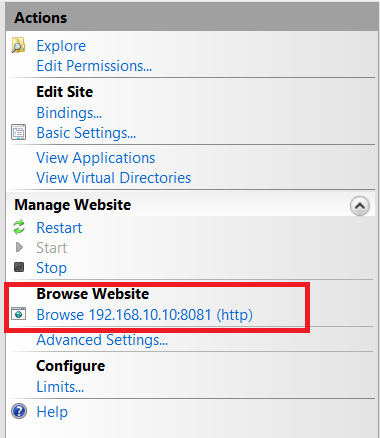

#  I. Tổng quan đề tài
## 1. Giới thiệu mô hình
Đề tài thực hiện việc tìm hiểu cách cài đặt, triển khai Firewall bằng pfSense, cách đặt luật, cài đặt DMZ cũng như kết hợp hệ thống cảnh báo phát hiện xâm nhập IDS/IPS trên nền tảng ảo hóa VMWare. Đề tài được xây dựng theo mô hình bao gồm:
* Firewall pfSense dùng 3 card mạng (NAT, VMnet2, VMnet3).
* DMZ dùng dùng hệ điều hành Windows 10 với 1 card mạng (VMnet3).
* Web Server dùng Windows Server 2012 với một card mạng (VMnet2).
* Máy Client dùng hệ điều hành Windows 10 với card mạng (NAT).


## 2. Công việc sẽ thực hiện
Công việc sẽ thực hiện bao gồm:
* Triển khai một Website cơ bản để demo cho chức năng của Web Server.
* Triển khai DMZ.
* Tiến hành Port Forward để NAT lớp mạng NAT vào lớp mạng LAN.
* Tiến hành tìm hiểu các rule cơ bản trên firewall.
* Cài đặt hệ thống IDS/IPS.
# II. Tiến hành
## 1. Triển khai Web Server Local
* Trên Windows Server 2012 truy cập vào Server Manager, chọn Manage -> Add roles and featuers
* Tiếp tục thực hiện các bước đến khi chọn gói cài đặt, ta chọn gói Web Server (ISS) để cài.


* Khi đã cài hoàn tất, ta vào Tool và vào ISS vừa mới cài xong. Bên cột bên trái ta tiến hành tạo một web site mới với tên, đường dẫn đến file index.html, địa chỉ IP và port được điền đầy đủ, có thể tham khảo hình dưới.   


* Ở đề tài này, website được thiết kế sẵn, bạn có thể tham khảo các website mẫu khác để thực hiện demo.


* Sau khi xong các bước cài đặt website ta tiến hành chạy thử bằng cách chọn Browse Website bên cột phải.


 * Hoặc đơn giản hơn là dùng trình duyệt và truy cập `https://IP_SERVER:PORT` như ở lab đã cấu hình thì truy cập `https://192.168.10.10:8081` ta được kết quả tương tự như hình.
 

## 2. Tiến hành Port Forward để NAT lớp mạng NAT vào lớp mạng LAN.
### a. Cấu hình
 Truy cập vào **Firewall** -> **NAT** và tiến hành Add theo các cấu hình dưới:
```
    interface WAN
    Address Family IPv4
    Protocol TCP/UDP
    Source Any
    Source port range Any
    Destination port range HTTP to HTTP
    Redirect target IP 
        Type Address or Alias 192.168.10.10
    Redirect target port
        Other 8080
```
 Ta sẽ được kết quả là một Rule mới trong NAT như hình:
 

 Tiếp theo truy cập vào **Interfaces** -> **WAN** và bỏ chọn mục `Block private networks and loopback address` như hình:
 
* `Block private networks and loopback address` : 
IP Private là những IP được cấp trong mạng LAN ví dụ 192.168.x.x/24, 10.x.x.x/8, 172.16.x.x/16. Nhưng việc những IP xuất hiện trên mạng internet dưới dạng IP Public là một điều bất thường nên Rule này sẽ chặn nhưng traffic đến card mạng WAN với source address là những IP private kể trên. 
* Việc **bỏ chọn** `Block private networks and loopback address` là để thuận tiện cho việc demo bởi lớp mạng WAN là 192.168.29.0/24 được cấp bằng DHCP của card mạng NAT trên VMWare. Tuy nhiên trong thực tế nên áp dụng Rule này.
* `Block bogon networks` : IP bogon là những địa chỉ IP không hợp lệ, có thể là những dãy IP không được IANA (Internet Assigned Numbers Authority) cấp phát hoặc những dãy được dùng với mục đích cụ thể không phải để định danh như Multicast,TEST-NET-1, TEST-NET-2, TEST-NET-3,...
* Việc **chọn** `Block bogon networks` hoàn toàn không ảnh hưởng đến kết quả demo và hoàn toàn phù hợp với thực tế.


Bước tiếp theo ta truy cập vào **Firewall** -> **RULES** chọn card **WAN** và tiến hành add rule theo các cấu hình dưới:
```
    Rule 1: Allow inbound Web Traffic to Server

    Action Pass
    Interface WAN
    Address Family IPv4
    Protocol TCP/UDP
    Source Any
    Source Port Range any
    Destination WAN address
    Destination Port Range
        other 8080 to 8080
```
```
    Rule 2: Bất kỳ traffic nào (TCP/UDP) đến cổng WAN 
    ở port 80, hãy chuyển nó vào 192.168.10.10 ở port 
    8080.

    Action Pass
    Interface WAN
    Address Family IPv4
    Protocol TCP/UDP
    Source Any
    Source Port Range any
    Destination 
        Address or Alias 192.168.10.10
    Destination Port Range
        other 8080 to 8080
```
Sau khi cấu hình xong ở Rule sẽ như hình:

### b. Kiểm tra cấu hình
Sau khi cấu hình NAT port Forward rồi thì Client từ ngoài Internet dùng card mạng NAT có thể truy cập đến Website đặt trong mạng LAN như hình dưới IP `192.168.29.131` là IP card mạng NAT trên Firewall.

Vì chưa có DMZ nên Firewall sẽ redirect sang trực tiếp WebServer nội bộ.

## 3. Triển khai DMZ
## 4. Tiến hành tìm hiểu các rule cơ bản trên firewall.
## 5. Cài đặt hệ thống IDS/IPS.